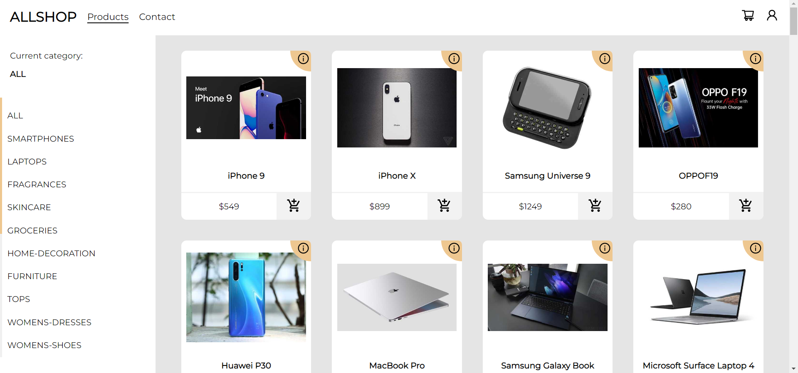

# ALLSHOP

Online shop made using React (React Router, Context API), TypeScript, styled-components <br />
Products data from [DummyJSON](https://dummyjson.com/)<br />
Work in progress...

## How to start the project

Clone the project to the selected location

```bash
    git clone https://github.com/rnycz/allshop-onlineshop
```

Go to the project directory

```bash
    cd allshop-onlineshop
```

Install necessary dependencies

```bash
    npm install
```

Start the app

```bash
    npm start
```

In your browser go to

```bash
    http://localhost:3000
```

## Project Screenshots

Main page <br />
 <br />
Products Page <br />
 <br />
